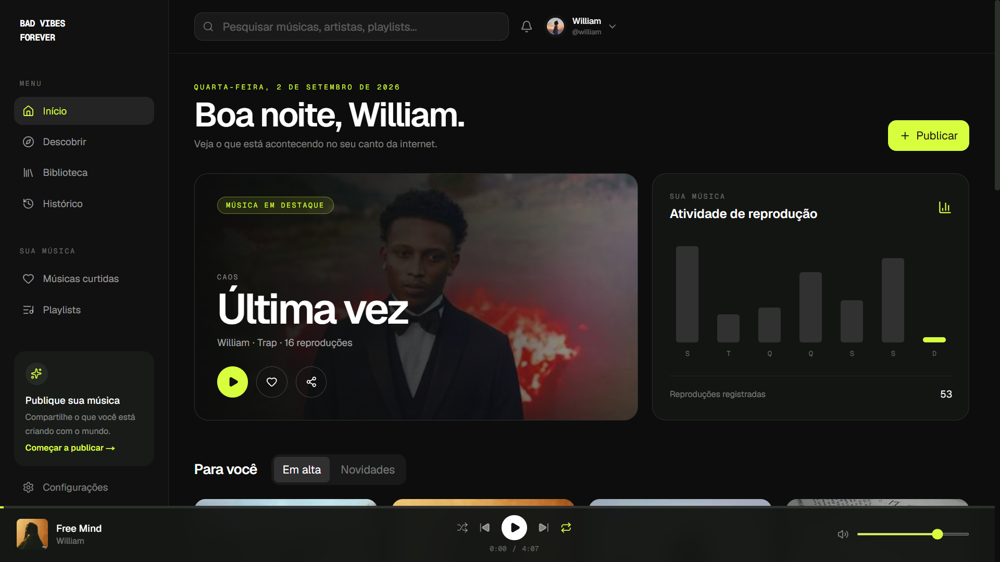
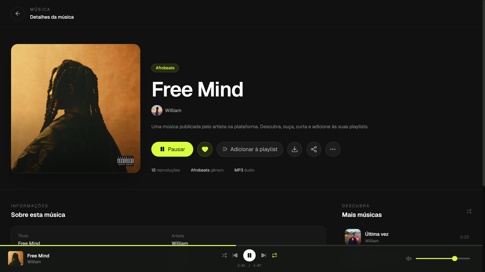

# BVF Frontend

Frontend da **BVF — Bad Vibes Forever**, uma plataforma de música para descobrir, ouvir e interagir com músicas e artistas.

## Screenshots

### BVF



### Track



## Tecnologias

* Next.js
* React
* TypeScript
* Tailwind CSS
* Zustand
* Axios

## Funcionalidades

* Autenticação
* Descoberta de músicas
* Pesquisa
* Reprodução de músicas
* Player de áudio
* Favoritos
* Playlists
* Álbuns
* Perfis de artistas
* Biblioteca
* Histórico de reprodução
* Downloads
* Upload de músicas
* Gestão de perfil

## Requisitos

* Node.js
* npm
* BVF API

## Instalação

```bash
git clone <repository-url>
cd bvf-frontend
npm install
```

Crie um ficheiro `.env.local`:

```env
NEXT_PUBLIC_API_URL=http://localhost:3333/api
```

## Desenvolvimento

```bash
npm run dev
```

A aplicação estará disponível em:

```text
http://localhost:3000
```

## Build

```bash
npm run build
npm start
```

## API

O frontend comunica com a **BVF API** para autenticação, músicas, artistas, playlists, favoritos, uploads e restantes funcionalidades da plataforma.

Por padrão:

```text
http://localhost:3333/api
```

## Licença

Este projeto está disponível sob a licença definida no ficheiro `LICENSE`.

## BVF

**Bad Vibes Forever**
